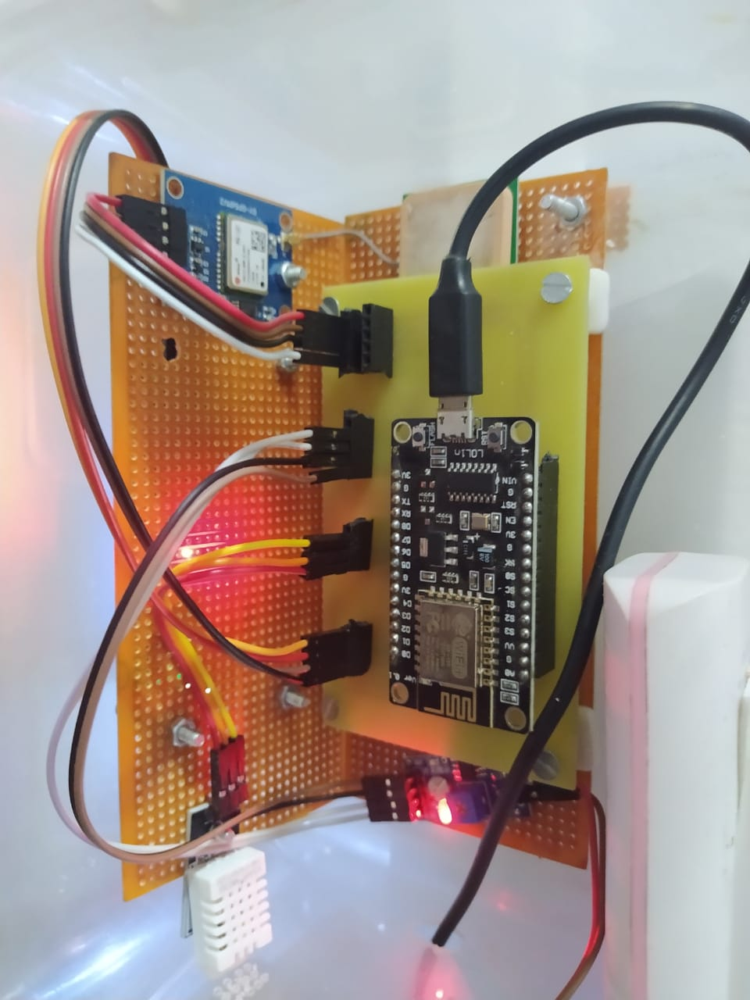
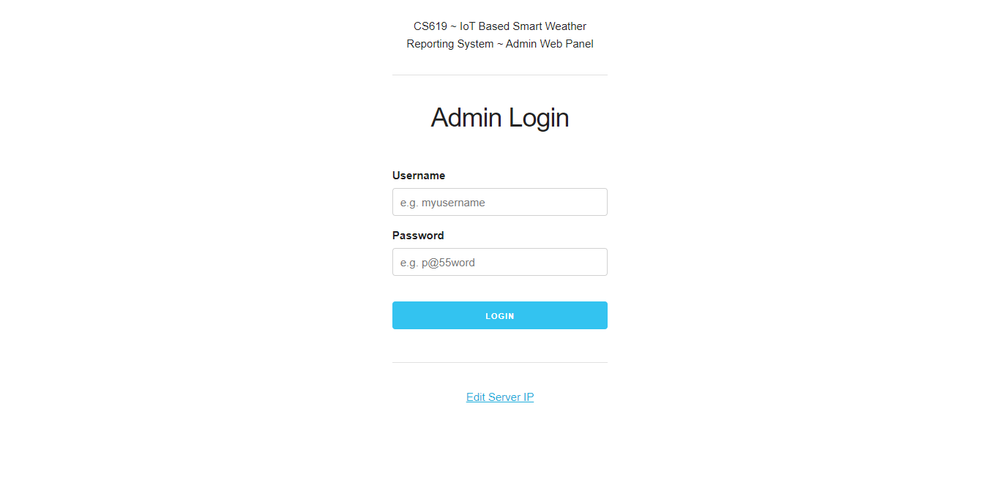

# IoT based Smart Weather Reporting System

Final year project (CS619 Spring & Fall 2020) for BSCS at Virtual University of Pakistan.

Student Name: Ahmed Noor E Alam

Supervisor: Kalim Ullah

## Introduction

An IoT based system that helps you to monitor live weather data (temperature, humidity and rain) at a location of your choice and set critical limits to get notified when they are crossed.

## Technologies Used

### Hardware Components
1. NodeMCU ESP8266 (Wi-Fi Enabled & Arduino SDK Compatible Microcontroller)
2. DHT22 Temperature + Humidity Sensor
3. YL-83 / MH-RD Rain Drop Sensor
4. U-Blox Neo 6m GPS Module
5. 16x2 I2C LCD Module

### Software Components
1. IoT Device: C/C++ Arduino SDK
2. Web Server: Python Flask
3. Admin Panel: ReactJS
4. Android App: Java Android SDK

## Architectural Overview

<kbd>
    
</kbd>
 

## IoT Device Schematic
<kbd>
    
</kbd>
 

### Pin Mappings

| Ublox Neo 6m GPS | NodeMCU ESP8266 |
| --- | --- |
| VCC | 3V3 |
| GND | GND |
| TXD | D7 |
| RXD | D8 |

| DHT 22 | NodeMCU ESP8266 |
| --- | --- |
| + | 3V3 |
| OUT | D5 |
| - | GND |

| Rain Drop Sensor | NodeMCU ESP8266 |
| --- | --- |
| VCC | 3V3 |
| GND | GND |
| DO | D6 |
| AO | A0 |

| 16x2 I2C LCD | NodeMCU ESP8266 |
| --- | --- |
| VCC | VV |
| GND | GND |
| SCL | D1 |
| SDA | D2 |

## PCB Design
<kbd>
    
</kbd>
 

## Final Deliverable Screenshots and Images

### User Android App
<kbd>
    
</kbd>
<kbd>
    
</kbd>
<kbd>
    
</kbd>
 

### IoT Device
<kbd>
    
</kbd>
<kbd>
    
</kbd>
 
<kbd>
    
</kbd>
<kbd>
    
</kbd>
 
<kbd>
    
</kbd>
<kbd>
    
</kbd>
 
<kbd>
    
</kbd>
 

### Admin Web Panel
<kbd>
    
</kbd>
 
<kbd>
    
</kbd>
 
<kbd>
    
</kbd>
 
<kbd>
    
</kbd>
 

## Setup and Usage Instructions

The system has four components.

1. Python Web Server
2. Admin Web Panel
3. IoT Device
4. User Android App

### 1. Python Server (Deploy on pythonanywhere.com):

1. Copy contents of `rest_api_web_server` in to a directory with the same name on pythonanywhere via either uploading a zip and then unzipping via opening a terminal or via cloning the git repo.
2. Creat new flask web app in root of the same directory. Just make sure the new file name should not override any pre-existing ones. By default the new file is named `flask_app.py`.
3. Clear the contents of the newly created `flask_app.py` file and add `from run import app` then save and reload the web app.

**The following details will be used for setting up the remaining components.**
- **Server IP:** &lt;your_username&gt;.pythonanywhere.com
  > Or if you deployed on a VPS, then your vps host name or ip.
- **Port:** 80 
  > Or if you deployed your app on other port, use that.
- **DEFAULT_SERVER_URL** i.e. ip+port+api_endpoint for android app: http://&lt;your_username&gt;.pythonanywhere.com:80/api/v1/user/device/data/get

### 2. Admin Web Panel:

1. Open terminal in `admin_web_panel` directory.
2. Type `npm install`.
3. Type `npm run build`. You will get the build of your web app in `build` directory.
4. Open `index.html` in browser and go to `Server IP` link and edit the server ip with yours. You don't need to add api_endpoint in the field. Just server ip + port e.g. `http://<your_username>.pythonanywhere.com:80`
5. Login with admin credentials. Default username is `admin` and password is `12345`.
6. Add a new device with new `Device ID`, `Device Password` and `User Password`.
   > Make sure that you check the `active` box while creating a new device, otherwise the server will not store new data from that device.

### 3. IoT Device:

1. Install ESP8266 Core Library for Arduino IDE by following the tutorial from the link below.
   > Link: https://randomnerdtutorials.com/how-to-install-esp8266-board-arduino-ide/
2. Unzip and copy the contents of `iot_device/libraries.zip` in to the libraries folder of your Arduino user directory i.e. `"This PC/Documents/Arduino/libraries/"`.
3. Check the `Schematic Diagram` from `diagrams` directory for wiring details and attach all the components to the board according to the wiring shown in the diagram.
4. Open `iot_device/ESP8266_Sketch/ESP8266_Sketch.ino` in your Arduino IDE and update your WiFi Name `#define SSID "..."` and WiFi Password `#define PASS "..."`.
5. Update `#define REST_SERVER_IP "..."` with your Server IP e.g. `http://<your_username>.pythonanywhere.com` and `#define REST_SERVER_PORT "..."` with the port where you deployed the python server  e.g. `:80`.
6. Copy the same `Device ID` and `Device Password` that you entered in the `Admin Web Panel`, and paste them in your IoT Sketch for `#define DEVICE_ID "..."` and `#define DEVICE_PASSWORD "..."`.
5. Connect your board to computer with Micro USB cable, and then select `NodeMCU v1.0 (ESP-12E Module)` from `Tools > Board: > ...` just like in installation instruction, then select `com port` and upload the sketch. Open Serial Monitor in your Arduino IDE to see output.
   > Note: The GPS module takes some time to connect to satellites.

### 4. User Android App:

1. Open in android studio.
2. Open `DatabaseActivity` and edit `DEFAULT_SERVER_URL` with your server url i.e. host + port + api_endpoint.
   e.g. `DEFAULT_SERVER_URL = "http://<your_username>.pythonanywhere.com:80/api/v1/user/device/data/get"`
3. Add `google_maps_key` in `.../src/debug/res/values/google_maps_api.xml` and `.../src/release/res/values/google_maps_api.xml` with your api key.
4. Run the app or build apk and install.
5. Use the same `Device ID` and `User Password` that you entered in the `Admin Web Panel`, and enter it in the login screen of mobile app to login and access device data.

~ *End of file.* ~
